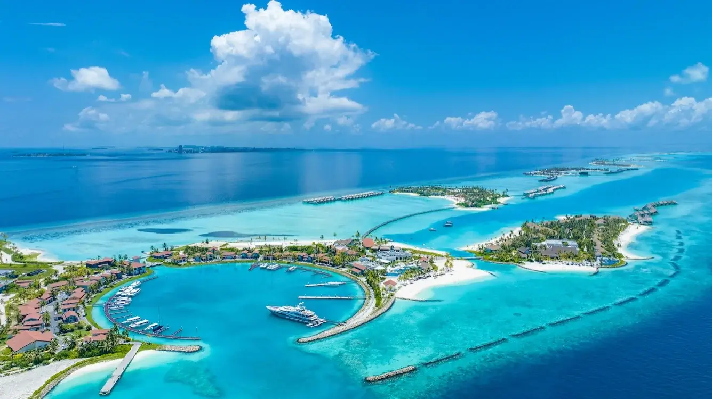
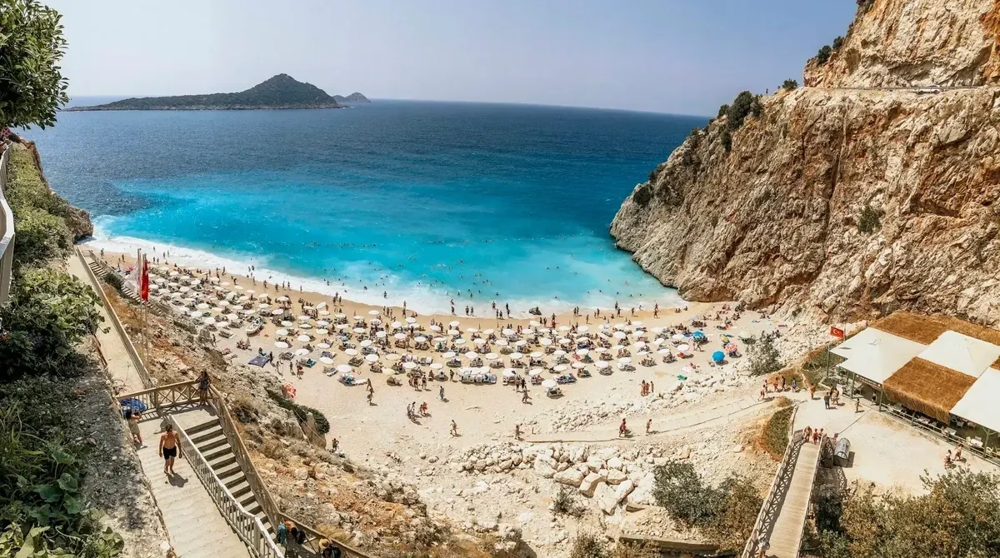
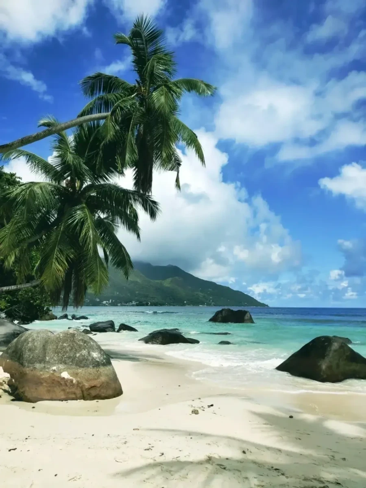
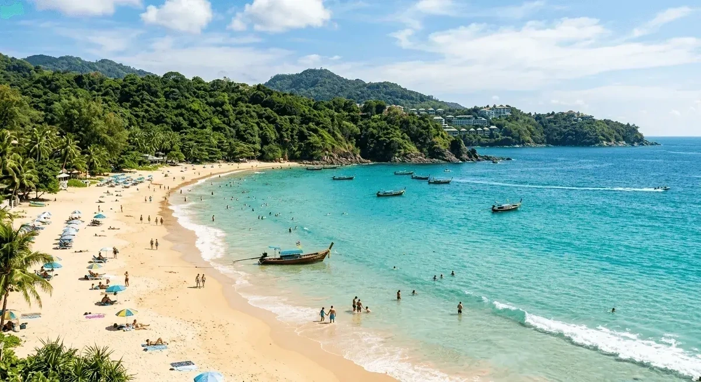
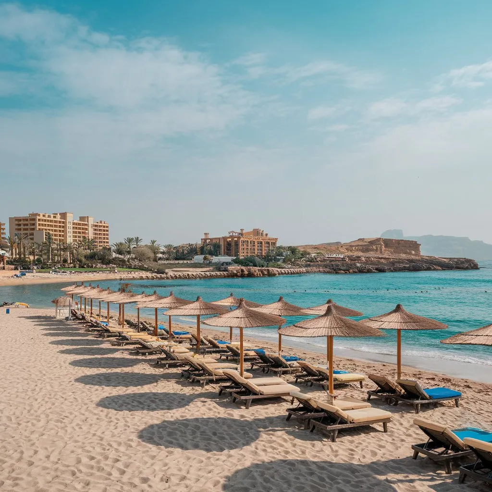
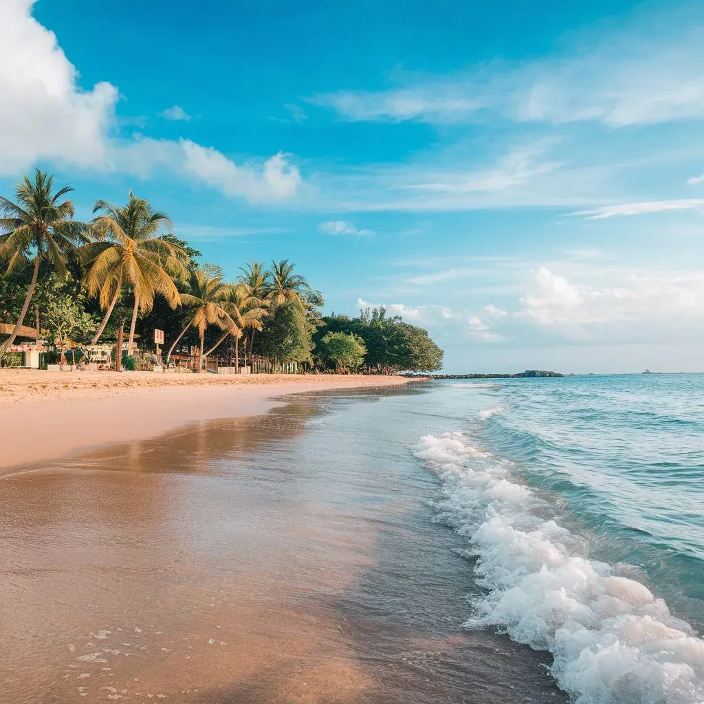

Выбор страны — это не только виза и перелёт. Это ответ на вопрос: «Что я хочу почувствовать в первую очередь — тишину, вкус, движение города или простоту отдыха с детьми?» Ниже — шесть направлений из нашего ассортимента, которые в 2026-м по-прежнему дают сильные эмоции и понятный сценарий поездки.

## Мальдивы — когда нужен «перезагрузочный» отдых

<figure class="blog-content-spot">

</figure>

Белый песок, вода нереальных оттенков бирюзы и ритм «ничего не надо». Мальдивы честны: это про виллу над водой, риф у ступенек и долгие завтраки без будильника. Если вам важны экскурсии каждый день — смотрите другие пункты списка; если нужно **просто выдохнуть** — здесь это работает лучше многих.

По секрету между нами

Бронируйте заранее и договаривайтесь о трансфере на лодке ещё до вылета — после длинного перелёта не хочется стоять в очереди, пока «договорится» телефон с местной связью.

## Турция — удобный выбор с открытой финальной оценкой

<figure class="blog-content-spot">

</figure>

Турция остаётся **хитом продаж** не случайно: прямые рейсы, понятная система «всё включено», море с конца апреля по октябрь. Но самое интересное — когда выбираешь не «Турцию вообще», а **конкретный курорт под свой характер**: Анталья — привычно и развито, Белек — простор и уровень, Сиде — история рядом с пляжем. Можно лечь и не вставать. Можно **выбраться в Каппадокию** и полетать на **воздушном шаре** на рассвете.

## Сейшелы — природа, которая не похожа на открытку из соседнего номера

<figure class="blog-content-spot">

</figure>

Гранит, пальмы, редкие птицы и ощущение, что вы не на «классическом all inclusive». Сейшелы ближе тем, кто любит **погулять, поплавать, повторить** — без гонки за галочками в экскурсионном листе. Острова разные: Маэ — жизнь и логистика, Праслен — один из красивейших пляжей мира, Ла-Диг — велосипеды и деревенский ритм.

## Таиланд — азиатский микс «и пляж, и город»

<figure class="blog-content-spot">

</figure>

Тут можно собрать и спокойные острова (Пхукет, Ко Самуи), и шумный Бангкок, и горы на севере. Для многих это первый длинный перелёт в Азию — и хороший компромисс между **ценой, едой и сервисом**. Главное — не пытаться увидеть всё за десять дней: лучше два акцента, чем чемодан нервов.

## Египет — понятный отдых для семьи

<figure class="blog-content-spot">

</figure>

Короткий перелёт, привычное «всё включено», море круглый год. Для родителей с детьми это часто **самый спокойный сценарий**: бассейн, анимация, пляж — и вы не герой индивидуального маршрута каждый день. Добавьте экскурсию к пирамидам, если тянет на историю — но не обязательно строить отпуск только вокруг них.

## Вьетнам — Азия в одном билете

<figure class="blog-content-spot">

</figure>

Север с Халонгом и шумным Ханоем, центр с Хойаном и пляжами Дананга, юг с Хошимином и дельтой Меконга — **в одной стране несколько разных путешествий**. Уличная еда, кофе со сгущёнкой и ночные рынки — не «галочка в гиде», а часть ритма. Вьетнам часто выбирают тем, кто хочет **Азию без сюрпризов по бюджету**: перелёты внутри страны доступны, а впечатлений — на несколько поездок вперёд.

> Хорошая поездка — та, после которой вы не чувствуете, что «надо отдохнуть от отпуска». Эти шесть направлений — разные способы этого добиться, и у каждого найдётся тот, кто скажет: «вот это — моё».

Если присмотрели что-то из списка — напишите нам: подскажем по сезону, перелётам и отелю под ваш темп, без навязанных «топов ради топа».
