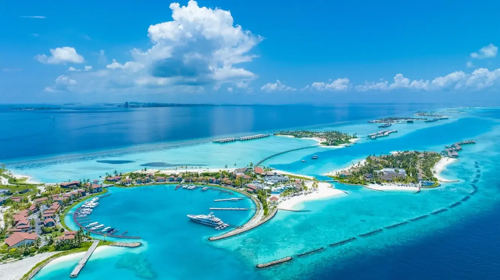
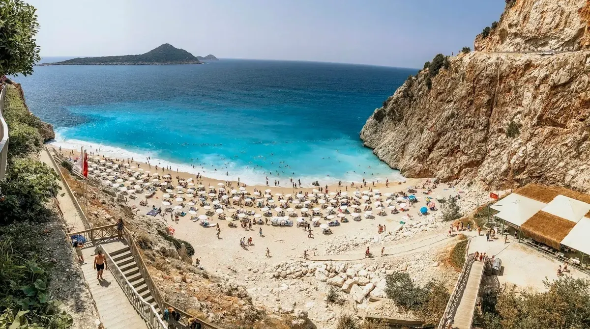
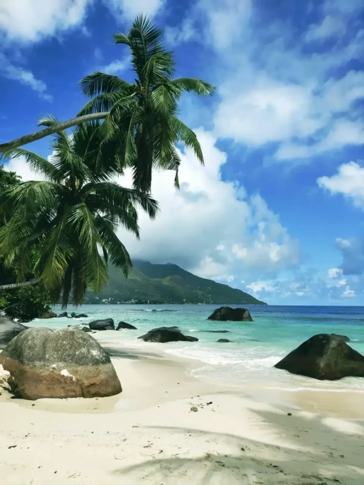
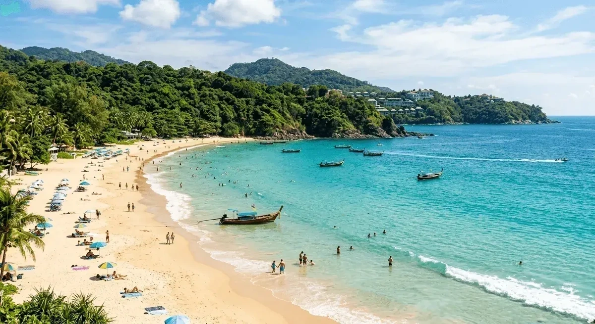
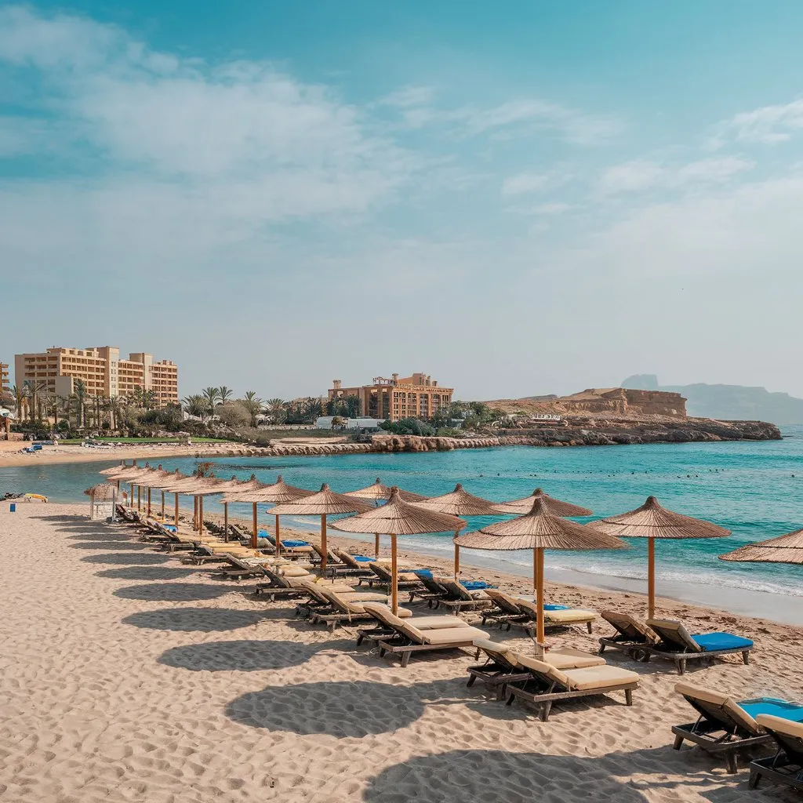
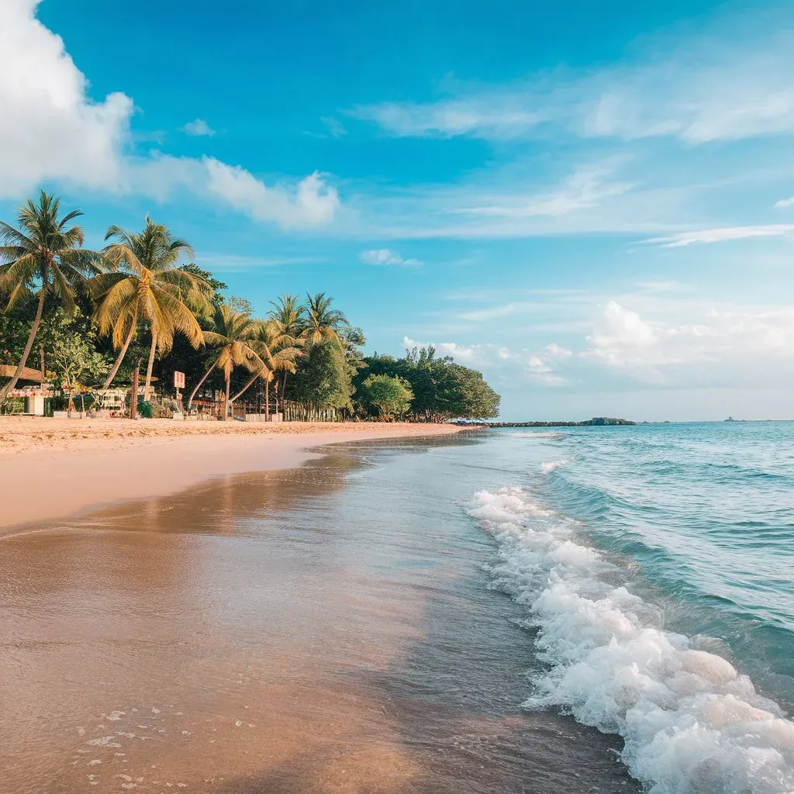

«Куда поехать?» — этот вопрос задают нам чаще любого другого. И самый честный ответ: зависит от того, что вы хотите почувствовать. Не «какая страна лучше» — они все хороши, но для разных людей и разных моментов жизни. Ниже — шесть направлений, которые мы знаем хорошо. Про каждое скажем главное: кому именно оно подойдёт.

## Мальдивы — когда нужен «перезагрузочный» отдых

<figure class="blog-content-spot">

</figure>

Белый песок, вода нереальных оттенков бирюзы и ритм «ничего не надо». Мальдивы честны: это про виллу над водой, риф у ступенек и долгие завтраки без будильника. Здесь не нужно ничего планировать — достаточно просто оказаться.

Кому подойдёт

Тем, кому нужно выдохнуть после долгого года — без экскурсионной гонки и чужого расписания. Тем, кто давно откладывал «мечту» и наконец решился. Любителям дайвинга и снорклинга: подводный мир здесь один из лучших в мире.

Бронируйте заранее и договаривайтесь о трансфере на лодке ещё до вылета — после длинного перелёта не хочется стоять в очереди, пока «договорится» телефон с местной связью.

## Турция — удобный выбор, если знаешь за что берёшь

<figure class="blog-content-spot">

</figure>

Турция остаётся хитом не случайно: прямые рейсы, понятная система «всё включено», море с конца апреля по октябрь. Самое интересное — когда выбираешь не «Турцию вообще», а конкретный курорт под свой характер. Анталья — привычно и развито. Белек — простор и уровень. Сиде — история рядом с пляжем. Можно лечь и не вставать. Можно выбраться в Каппадокию и полетать на воздушном шаре на рассвете.

Кому подойдёт

Семьям с детьми: понятная инфраструктура, анимация, детские бассейны, еда без сюрпризов. Тем, кто едет впервые и хочет «без стресса». Тем, кто любит сочетать пляж с культурными вылазками — Каппадокия, Эфес, Памуккале рядом.

## Сейшелы — природа, которая не похожа на открытку из соседнего номера

<figure class="blog-content-spot">

</figure>

Гранит, пальмы, редкие птицы и ощущение, что это не классический отдых «всё включено». Сейшелы ближе тем, кто любит **погулять, поплавать, повторить** — без гонки за галочками. Острова разные: Маэ — жизнь и логистика, Праслен — один из красивейших пляжей мира, Ла-Диг — велосипеды и деревенский ритм.

Кому подойдёт

Тем, кто ценит природу и тишину больше, чем развлечения. Парам, которые хотят уединения без ощущения «курортного конвейера». Тем, кто уже был в Турции, Египте, Таиланде — и ищет что-то принципиально другое.

## Таиланд — азиатский микс «и пляж, и город»

<figure class="blog-content-spot">

</figure>

Тут можно собрать и спокойные острова (Пхукет, Ко Самуи), и шумный Бангкок, и горы на севере. Для многих это первый длинный перелёт в Азию — и хороший компромисс между ценой, едой и сервисом. Главное — выбрать два акцента, а не пытаться охватить всё за десять дней.

Кому подойдёт

Тем, кто хочет и пляж, и движение города в одной поездке. Гастротуристам: уличная еда здесь — отдельное путешествие. Тем, кто едет в Азию впервые и хочет мягкий вход: сервис понятный, цены доступные, английский повсюду.

## Египет — понятный отдых для семьи

<figure class="blog-content-spot">

</figure>

Короткий перелёт, привычное «всё включено», море круглый год. Для родителей с детьми это часто самый спокойный сценарий: бассейн, анимация, пляж — и вы не герой индивидуального маршрута каждый день. Добавьте экскурсию к пирамидам, если тянет на историю.

Кому подойдёт

Семьям с детьми, особенно если важен аквапарк и детский клуб прямо в отеле. Тем, кто ценит короткий перелёт и хочет море уже через 4 часа. Дайверам и снорклерам — Красное море входит в топ-10 мира по богатству подводного мира.

## Вьетнам — Азия в одном билете

<figure class="blog-content-spot">

</figure>

Север с Халонгом и шумным Ханоем, центр с Хойаном и пляжами Дананга, юг с Хошимином и дельтой Меконга — в одной стране несколько разных путешествий. Уличная еда, кофе со сгущёнкой и ночные рынки — не «галочка в гиде», а часть ритма.

Кому подойдёт

Тем, кто хочет маршрут, а не «лежать у моря». Любопытным: история, архитектура, кухня — всё в одном направлении. Тем, кто ищет Азию без лишних трат: внутренние перелёты доступные, а впечатлений — на несколько поездок вперёд.

> Хорошая поездка — та, после которой не чувствуешь, что «надо отдохнуть от отпуска». Эти шесть стран закрывают разные запросы — и у каждой найдётся тот, кто скажет: «вот это — моё».

Если присмотрели что-то из списка — напишите нам: уточним по сезону, перелётам и конкретному отелю под ваш темп.
